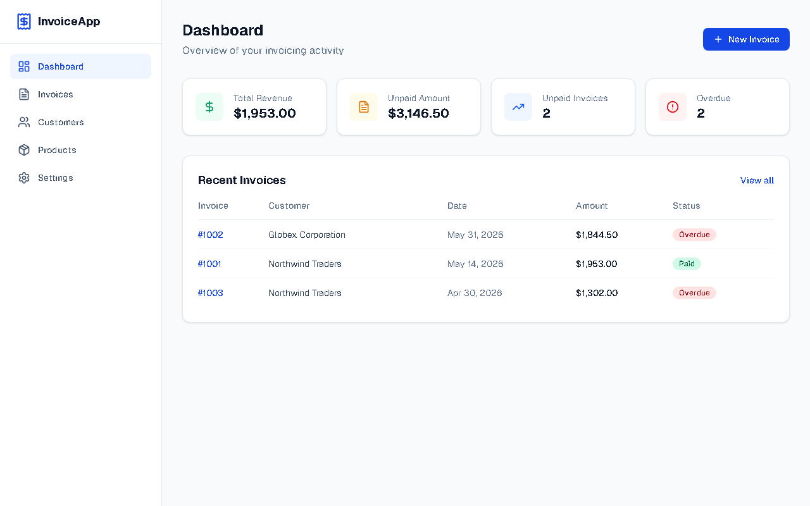
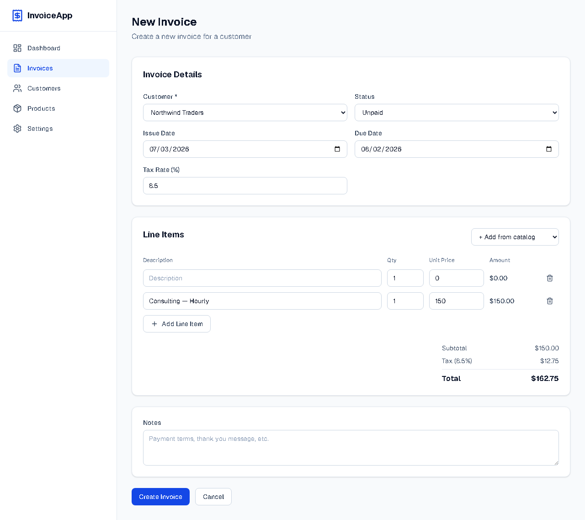

# InvoiceApp

**Live demo:** [https://invoice-app-zeta-orcin.vercel.app](https://invoice-app-zeta-orcin.vercel.app)

A modern invoice and quote management app for solo contractors, built with Next.js, React, and Tailwind CSS. Everything runs in the browser — no account or backend required.





## Features

### Core

- **Dashboard** — Revenue collected, unpaid balances, overdue count, aging report, and recent invoices
- **Customers** — Create and manage customer contacts with multi-field search
- **Products & Services** — Catalog items with search by name, description, or price
- **Invoices & Quotes** — Create invoices or quotes; convert a quote to an invoice when accepted
- **Search & filters** — Find invoices by customer, status, job/PO reference, and more

### Invoicing

- **Line items** — Choose **Unit × Qty** or **Flat price** per line
- **Discounts** — Apply a percentage or fixed discount on the invoice
- **Auto-calculations** — Subtotal, tax, discount, and total computed automatically
- **Job / PO reference** — Optional reference field on each document
- **Job photos** — Attach photos to an invoice (shown on PDF)
- **Terms & conditions** — Separate from notes; set a default in Settings
- **Duplicate invoice** — Copy an existing invoice to start a new one quickly

### Payments

- **Partial payments** — Record one or more payments per invoice
- **Payment history** — Full payment log, separate from the totals block
- **Balance due** — Status updates automatically (Paid / Unpaid / Partial / Overdue)

### Documents

- **5 templates** — Classic, Modern, Bold, Elegant, and Minimal
- **Live PDF preview** — Invoice detail page shows the actual PDF before download
- **PDF export** — Download invoice or quote PDFs with logo, photos, and payment history
- **Receipt PDF** — Generate a receipt after payment
- **Email & share** — Open your email client with pre-filled details, or copy/share invoice text

### Settings & data

- **Business profile** — Name, contact info, default tax rate, and default terms
- **Logo upload** — Your logo appears on PDFs and previews
- **Backup** — Export and import all app data as JSON
- **Local storage** — Data stays in your browser (`localStorage`); nothing is sent to a server

## Getting Started

```bash
npm install
npm run dev
```

Open [http://localhost:3000](http://localhost:3000).

## Testing

```bash
npm test
```

## Suggested Workflow

1. Go to **Settings** — Enter business details, upload your logo, and set default tax and terms
2. Add **Customers** and **Products**
3. Create an **Invoice** or **Quote** — Add line items (unit or flat pricing), job reference, and photos if needed
4. Record **partial or full payments** on the invoice detail page
5. Preview the PDF, then download or email it to your customer
6. Use **Export backup** in Settings periodically to save your data

## Deploy

```bash
npx vercel --prod
```

## Regenerating Screenshots

```bash
npm run screenshots
```

## Tech Stack

- Next.js 16 · React 19 · Tailwind CSS 4
- jsPDF + jspdf-autotable for PDF generation
- Vitest for unit tests
- Data persisted in browser `localStorage`

## Future Enhancements

- Recurring invoices
- Payment reminders
- Online payments (e.g. Stripe)
- Multiple businesses
- Multiple currencies
- Expense tracking & reports
- Dark mode
